[toc]
## 写在前面
本文主要是一个go开发者，入门rust学习的一点总结，都是基础语法相关的，会从基础语法，所有权，借用，可变借用，trait，智能指针和异步编程等知识点的介绍，最后通过三个实战小demo（web开发，cli命令行工具开发和task任务开发）继续校验学习成果

## rust安装
工欲善其事，必先利其器。先看如何快速安装rust,我们安装一个rust版本管理工具，当然你也可以直接安装rust，我这里以Linux为例
### rustup
rustup是rust的一个版本管理工具，可以帮助我们安装和切换到不同的rust版本，使用以下命令安装工具链
```shell
curl --proto '=https' --tlsv1.2 -sSf https://sh.rustup.rs | sh
```
按提示选择默认安装选项（推荐选项 1）

安装完成后，执行以下命令：
```shell
source $HOME/.cargo/env
```
可以使用以下命令验证是否安装成功
```shell
> rustup --version
rustup 1.28.1 (f9edccde0 2025-03-05)
info: This is the version for the rustup toolchain manager, not the rustc compiler.
info: The currently active `rustc` version is `rustc 1.86.0 (05f9846f8 2025-03-31)`
```

### rust安装
下面我们来正式安装rust
```shell
# 安装指定版本（例如 1.65.0 和 1.64.0）
rustup install 1.65.0
rustup install 1.64.0

# 查看已安装版本
rustup show

# 临时切换版本
rustup run 1.65.0 rustc --version

# 设置默认版本
rustup default 1.65.0
```
验证rust是否安装成功：
```shell
> rustc --version
rustc 1.86.0 (05f9846f8 2025-03-31)

```

验证cargo是否被成功安装
cargo是rust的包管理工具，你暂时可以理解为go的mod功能
```shell
> cargo --version
cargo 1.86.0 (adf9b6ad1 2025-02-28)
```

## 第一个rust程序
老规矩，我们先来写一个hello,rust程序
```shell
vim main.rs
```
写入一下内容：
```rust
fn main() {
    println!("hello, rust!"); //println!是rust中的宏，暂时理解打印即可
}
```

然后运行以下进行编译
```shell
rustc main.rs
```
然后运行这个二进制文件就可以了
```shell
> ls
main  main.rs

> ./main 
hello, rust!
```

## 基础语法
下面是rust的基础语法，可以看下面这个图：
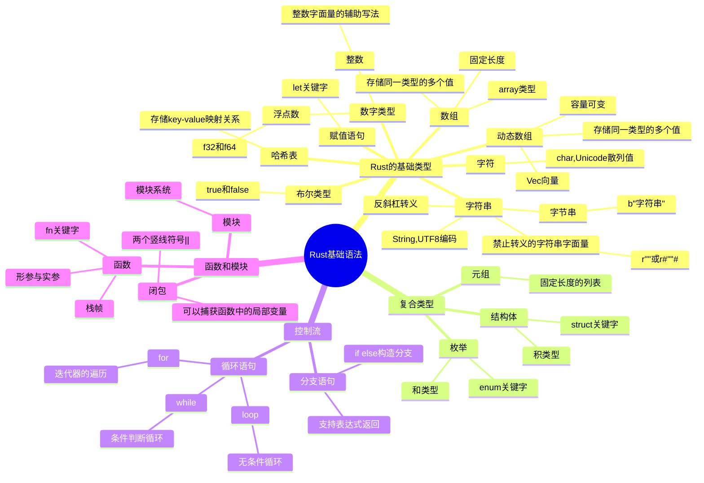


### 基础数据类型
和其他语言一样，该有的基础数据类型都有，这里我们简单过一下
#### 标量类型
```rust
fn main() {
    // -------------------------------
    // 1. 标量类型 (Scalar Types)
    // -------------------------------

    // 整数类型 - 默认推导为 i32
    let integer: i32 = -42;       // 有符号整数
    let unsigned: u32 = 1024;     // 无符号整数

    // 浮点类型 - 默认推导为 f64
    let float: f64 = 3.14159;     // 双精度浮点

    // 布尔类型
    let is_rust_cool: bool = true;

    // 字符类型 (Unicode 标量)
    let emoji: char = '🚀';
    
    let x: i32 = 100;
    x = 101;

    // -------------------------------
    // 打印所有值
    // -------------------------------
    println!("整数: {} (有符号), {} (无符号)", integer, unsigned);
    println!("浮点数: {:.2} (保留两位小数)", float); // 格式化输出
    println!("布尔值: {}", is_rust_cool);
    println!("字符: {}", emoji);
}
```
输出如下：
```rust
> ./main
整数: -42 (有符号), 1024 (无符号)
浮点数: 3.14 (保留两位小数)
布尔值: true
字符: 🚀

```
这里需要注意的几个点：
* let: rust变量的声明必须使用let开头,然后是变量名称，类型，末尾需要使用；结束，像下面这种
```rust
let integer: i32 = -42;  
```
* mut 表示可变的意思，如果你需要改变某一个变量的值，我们在声明时就需要这样声明
```rust
let mut x: i32 = 100;
x = 101;
```
这样做有什么好处吗？当然的rust是一门非常严谨的语言，但我们在看到mut需要注意了，说明后续这个变量一定会被使用到并且做值的改变，这在系统开发中，可以对开发者起到一个紧觉的作用

#### 复合类型
```rust
fn main() {
    // -------------------------------
    // 2. 复合类型 (Compound Types)
    // -------------------------------

    // 元组 (Tuple) - 固定长度不同类型
    let tuple: (i32, f64, char) = (500, 6.28, 'θ');

    // 数组 (Array) - 固定长度相同类型
    let array: [i32; 5] = [1, 2, 3, 4, 5];


    // 元组解构和访问
    let (x, y, z) = tuple;
    println!("元组解构: x={}, y={}, z={}", x, y, z);
    println!("元组索引: 索引1 = {}", tuple.1);

    println!("数组: {:?}", array);          // 使用 Debug trait 打印
    println!("数组首元素: {}", array[0]);    // 索引访问
}
```
输出：
```
> ./main       
元组解构: x=500, y=6.28, z=θ
元组索引: 索引1 = 6.28
数组: [1, 2, 3, 4, 5]
数组首元素: 1

```

#### 字符串类型
```rust
fn main() {
    // -------------------------------
    // 3. 字符串类型
    // -------------------------------
    // &str：字符串切片（不可变视图）
    let greeting: &str = "Hello, Rustaceans!";

    // String：可增长的堆分配字符串
    let mut message = String::from("Learning");
    message.push_str(" Rust!");  // 修改字符串


    // 元组解构和访问
    let (x, y, z) = tuple;
    println!("元组解构: x={}, y={}, z={}", x, y, z);
    println!("元组索引: 索引1 = {}", tuple.1);

    println!("数组: {:?}", array);          // 使用 Debug trait 打印
    println!("数组首元素: {}", array[0]);    // 索引访问

    println!("字符串切片: {}", greeting);
    println!("可变字符串: {}", message);
}
```
输出：
```
> ./main       
元组解构: x=500, y=6.28, z=θ
元组索引: 索引1 = 6.28
数组: [1, 2, 3, 4, 5]
数组首元素: 1
字符串切片: Hello, Rustaceans!
可变字符串: Learning Rust!
```

#### 动态数组Vec
动态数组的开发中是无处不在，我们来看看动态数组, 直接看示例
```rust
fn main() {
    let mut subject_list = vec![]; //声明一个vec, 这里可以不指明数据类型，在具体使用时，编译器会自动推断
    subject_list.push("math");
    println!("subject_list: {:?}", subject_list);


    let mut vector: Vec<i32> = vec![1, 2, 4, 8];
    vector.push(16);
    vector.push(32);
    vector.push(64);
    println!("{:?}", vector);

    let mut member_list: Vec<&str> = vec!["iceymoss", "kuk", "taks"];
    member_list.push("lak"); // push元素
    member_list.remove(0); // 移除索引为0的元素
    println!("{:?}", member_list);
    println!("{}", member_list[2]); // 索引访问
}
```

#### 哈希表
哈希表这种东西，在go里面我们我们知道是map这种数据类型，来看看rust中的
```rust
use std::collections::HashMap; //哈希表在标准库中，需要手动导入，use关键字是rust导入方式

fn main() {
    let mut age = HashMap::new(); //声明一个哈希表，未指定类型, 在使用时自动推断类型
    age.insert("iceymoss", 18);
    println!("{:?}", age.get("iceymoss"));

    let mut year: HashMap<i32, String> = HashMap::new();
    year.insert(2000, "龙".to_string()); // 字符串切片转为String
    year.insert(2025, "蛇".to_string());
    println!("year: {:?}", year);

    let mut pass: HashMap<&str, bool> = HashMap::new();
    pass.insert("iceymoss", true);
    pass.insert("lass", false);
    pass.remove("lass");
    println!("pass: {:?}", pass);
    println!("len: {}", pass.len());
    println!("key: {:?}", pass.keys());
    println!("value: {:?}", pass.values());
}
```
输出：
```
> ./main 
Some(18)
year: {2025: "蛇", 2000: "龙"}
pass: {"iceymoss": true}
len: 1
key: ["iceymoss"]
value: [true]
```

### 复合数据类型
在rust中复合数据类似主要是：元组，结构体和枚举
#### 元组
如何理解元组呢， 在go中没有元组这个东西啊，我是将其理解为大杂烩，啥都可以放进来，主要特定如下：
* 固定长度：创建后元素数量不可改变
* 异构：元素可以是不同类型
* 匿名字段：通过索引位置而非名称访问
* 零成本抽象：编译时确定类型，运行时无开销

来看一个简单示例：
```rust
fn main() {
    let tuple: (i32, f32, bool) = (23, 32.4, true);
    let i: i32 = tuple.0;
    let f: f32 = tuple.1;
    let x: bool = tuple.2;
    println!("{}", i);
    println!("{}", f);
    println!("{}", x);

    let tuple1: (i32, f32, bool) = (23, 32.4, true);
    // 直接解构
    let (a, b, c) = tuple;
    println!("{}", a);
    println!("{}", b);
    println!("{}", c);
}
```

### 结构体
结构体那可太有用了，可以用来封装各种功能，在rus中使用```struct```关键字来定义，直接看示例：
```rust
// 定义一个Person结构体
struct Person {
    name: String,
    age: i8
}

fn main() {
    let p = Person { // 注意：在rust中必须所有字段绑定值的，不然编译器是无法通过的，这也是rust非常严谨的一个体现
        name:String::from("iceymoss"), //String在堆空间中
        age:18,
    };
    
    println!("person: name={},age={}", p.name, p.age); //结构体字段使用.进行访问
}
```
输出：
```
> ./main
person: name=iceymoss,age=18
```
再来看一个复杂的结构体，结构体嵌套：
```rust
// 定义一个坐标
struct Point {
    x: f32,
    y: f32,
}

// 定义一个居住信息
struct Live {
    name: String,
    point: Point,
}

// 定义一个个人信息
struct Person {
    name: String,
    age: u8,
    likes: u8,
    gender: u8,
    live: Live
}

fn main() {
    // 实例化一个Person
    let ming: Person = Person {
        name: "iceymoss".to_string(),
        age: 20,
        likes: 5,
        gender: 1,
        live: Live { // 实例化
            name: "ShangHai".to_string(),
            point: Point { x: 123.32, y: 38.2374 }, // 实例化
        }
    };

    println!("ming.name = {}", ming.name);
    println!("ming.age = {}", ming.age);
    println!("ming.likes = {}", ming.likes);
    println!("ming.gender = {}", ming.gender);
    println!("ming.live.name = {}", ming.live.name);
    println!("ming.points.x = {}", ming.live.point.x);
    println!("ming.points.y = {}", ming.live.point.y);

}
```
输出：
```rust
> ./struct_demo 
ming.name = iceymoss
ming.age = 20
ming.likes = 5
ming.gender = 1
ming.live.name = ShangHai
ming.points.x = 123.32
ming.points.y = 38.2374
```

### 枚举
枚举在rust中真的是无处不见，大名鼎鼎的Result<T, E>和Option<T>，先来看看枚举如何使用：
```rust

#[derive(Debug)]
enum Book {
    Papery,  // 纸质书
    Electronic // 电子书
}

fn main() {
    let book = Book::Papery; // 声明一个枚举
    println!("{:?}", book);
}
```
这里表示定义了书的枚举，其中有两个变体，纸质书和电子书，输出：
```
> ./enum_demo 
Papery
```

没错枚举就是这么简单，上强度, 在枚举中还可以包含字段，看示例：
```rust
enum Book {
    Papery {index: u32}, // 变体中定义了u32类型的一个索引，表示书的页号
    Electronic {url: String}, // 变体中定义了一个String类型的url，表示电子书的链接
}

fn main() {
    let book = Book::Papery{index: 1001};
    let ebook = Book::Electronic{url: String::from("http://mybook.com/electronic/bookname/index.html")};

    // match 枚举类实例 {
    //     分类1 => 返回值表达式,
    //     分类2 => 返回值表达式,
    //     ...
    // }

    // match 枚举类实例 {
    //     分类1 => {执行的代码块},
    //     分类2 => {执行的代码块},
    //     ...
    // }
    match book {
        Book::Papery { index } => {
            println!("Papery book {}", index);
        },
        Book::Electronic { url } => {
            println!("E-book {}", url);
        }
    }

    match ebook {
        Book::Electronic { url } => {
            println!("E-book {}", url);
        }
        Book::Papery { index } => {
            println!("Papery book {}", index);
        }
    }
}
```
先来看看输出：
```
> ./main
Papery book 1001
E-book http://mybook.com/electronic/bookname/index.html
```
我们可以看到```match```，没错他就是rust中大名鼎鼎的匹配模式，我们来看看Option<T>是怎么使用的：
```rust

// Option是标准库中的
// enum Option<T> {
//     Some(T),
//     None,
// }

fn main() {
    let opt = Option::Some("Hello");
    match opt {
        Option::Some(something) => {
            println!("{}", something);
        },
        Option::None => {
            println!("opt is nothing");
        }
    }


    let opt1: Option<&str> = Option::None;
    match opt1 {
        Option::Some(something) => {
            println!("{}", something);
        },
        Option::None => {
            println!("opt is nothing");
        }
    }

    // 由于Option是rust内部提供的，所以支持直接简化写法
    let t = Some(64);
    match t {
        Some(64) => println!("Yes"),
        _ => println!("No"), // 注意，枚举在匹配模式中，需要列出所有变体，如果不想匹配所有变体，使用_进行处理
    }

    //if let 语法
    let i = 1;
    match i {
        0 => println!("zero"),
        _ => {
            println!("unkown i");
        },
    }
}
```

### 控制流
#### 条件语句
和所有编程语言一样，也就是```if - else if - else ```, rust的条件语句风格其实和go非常相似，直接来看示例：
```rust
fn main() {
    let number = 6;

    if number % 4 == 0 {
        println!("number is divisible by 4");
    } else if number % 3 == 0 {
        println!("number is divisible by 3");
    } else if number % 2 == 0 {
        println!("number is divisible by 2");
    } else {
        println!("number is not divisible by 4, 3, or 2");
    }
}
```
看上去是不是中规中矩，接着看示例，使用代码块：
```rust
fn main() {
    let condition = true;
    let number = if condition {
        5
    } else {
        6
    };

    println!("The value of number is: {}", number);
}
```
if分支还可以做这种表达式，看上去是不是很像三元表达式, rust的条件语句非常简单

#### while
我们知道在go中其实是没有```while```关键字的，看示例：
```rust
fn main() {
    let mut x: i32 = 100;
    while x != 0 {
        println!("value: {}", x);
        x -= 1;
    }

    let arr:[i32; 10] = [1, 2, 3, 4, 5, 6, 7, 8, 9, 10];
    let mut index: i32 = 0;
    while index < arr.len() as i32 {
        println!("value: {}", arr[index as usize]);
        index += 1;
    }

}
```
输出：
```
> ./demo4 
value: 100
value: 99
value: 98
value: 97
value: 96
value: 95
value: 94
value: 93
value: 92
value: 91
value: 90
value: 89
value: 88
value: 87
value: 86
value: 85
value: 84
value: 83
value: 82
value: 81
value: 80
value: 79
value: 78
value: 77
value: 76
value: 75
value: 74
value: 73
value: 72
value: 71
value: 70
value: 69
value: 68
value: 67
value: 66
value: 65
value: 64
value: 63
value: 62
value: 61
value: 60
value: 59
value: 58
value: 57
value: 56
value: 55
value: 54
value: 53
value: 52
value: 51
value: 50
value: 49
value: 48
value: 47
value: 46
value: 45
value: 44
value: 43
value: 42
value: 41
value: 40
value: 39
value: 38
value: 37
value: 36
value: 35
value: 34
value: 33
value: 32
value: 31
value: 30
value: 29
value: 28
value: 27
value: 26
value: 25
value: 24
value: 23
value: 22
value: 21
value: 20
value: 19
value: 18
value: 17
value: 16
value: 15
value: 14
value: 13
value: 12
value: 11
value: 10
value: 9
value: 8
value: 7
value: 6
value: 5
value: 4
value: 3
value: 2
value: 1
value: 1
value: 2
value: 3
value: 4
value: 5
value: 6
value: 7
value: 8
value: 9
value: 10

```

#### loop
loop就是无限循环的意思，可以理解为go的```for{...} ```看看示例：
```rust
fn main() {
    let mut x: i32 = 0; //mut 表示可以变
    loop {
        x = x + 1;
        if x == 50 { //等于50时退出循环
            break;
        }
        println!("{}", x);
    }
}
```

#### 迭代器（for)
对于遍历某一些数据结构，我们可能使用迭代器会更方便，我们来读取数据，例如在go中我们常用```for i, v := range list {...}```,下面我们来看看rust的迭代器，这需要注意的是，会涉及到rust的所有权三态（所有权变量，不可变引用变量和可变引用变量），先来看示例：
```rust
fn main() {
    for i in 1..=1000 { //迭代1000次, 注意这里的边界问题，[1,1000]， 如果是0..=1000那就是[0,1000]了
        if i > 101 { //退出
            break;
        }
        println!("{}", i);
    }

    for j in 'a'..='z' { // 从a迭代到z，注意边界，[a,z]
        if j == 'y' {
            break;
        }
        println!("{}", j);
    }
}
```

##### 所有权移动迭代
语法是这样的```for i in list``` 这样迭代的话，list中的每一个元素随着迭代进行，他们的所以权会自动到i上，看示例：
```rust
fn main() {
    let mut list = vec![10, 2, 111, 34, 12, 43];
    for i in list { // 会移动所有权
        println!("{}", i);
    }
}
```
输出：
```
10
2
111
34
12
43
```
这样看着没有问题，但是如果我们想继续使用list，看看会发送什么？
```rust
fn main() {
    let mut list = vec![10, 2, 111, 34, 12, 43];
    for i in list { // 会移动所有权
        println!("{}", i);
    }

    let l = list; // 注意这里
}
```
当我们编译时会发现报错：
```
> rustc range.rs
error[E0382]: use of moved value: `list`
   --> range.rs:44:14
    |
19  |     let list = vec![10, 2, 111, 34, 12, 43];
    |         ---- move occurs because `list` has type `Vec<i32>`, which does not implement the `Copy` trait
...
39  |         for i in list { // 会移动所有权
    |                  ---- `list` moved due to this implicit call to `.into_iter()`
...
44  |     let _l = list;
    |              ^^^^ value used here after move
    |
note: `into_iter` takes ownership of the receiver `self`, which moves `list`
   --> /home/jeff/.rustup/toolchains/stable-x86_64-unknown-linux-gnu/lib/rustlib/src/rust/library/core/src/iter/traits/collect.rs:313:18
    |
313 |     fn into_iter(self) -> Self::IntoIter;
    |                  ^^^^
help: consider iterating over a slice of the `Vec<i32>`'s content to avoid moving into the `for` loop
    |
39  |         for i in &list { // 会移动所有权
    |                  +

error: aborting due to 1 previous error

For more information about this error, try `rustc --explain E0382`.
```
这里的提示就是说list的所有权发送了移动，list失去了对堆空间值的所有权，他会被回收掉，所以不能再使用了。

##### 不可变引用迭代
语法是这样的，```for i in &list``` 多了一个&符号，示例：
```rust
fn main() {
    let mut list = vec![10, 2, 111, 34, 12, 43];
    for i in &list { // 不可变借用，开始借用list 
        println!("{}", i);
    }
    //这里归还借用

    let l = list; 
}
```
当我们使用不可变引用时，后续迭代器归还借用后，就可以继续使用list了

##### 可变引用
语法就是加了一个mut关键字，```for i in &mut list```,&引用，mut可变，示例：
```rust
fn main() {
    let mut list = vec![10, 2, 111, 34, 12, 43];
    for i in &mut list { // 可变借用
        if *i == 2 {
            *i = 1000 //可变借用就可以改变值了
        }
    }
}
```

### 函数
函数使用```fn```进行定义，```->```表示返回值，示例：
```rust
fn add(x: i32, y: i32) -> i32 { //有返回值
    x + y // 等同于 return x + y
}

fn print(str: &str) { // 没有返回值
    println!("{}", str);
}

fn main() {
    let ans = add(10, 20);
    println!("add: {} + {} = {}", 10, 20, ans);
    print("hello, iceymoss");
}
```
再看一些复杂的示例：
```rust
// 函数体中的表达式与语句
fn check_even(num: i32) -> bool {
    // 使用表达式返回值 (无 return 关键字)
    num % 2 == 0
}

fn print_result(num: i32) {
    // 使用语句执行操作（无返回值）
    println!("数字 {} 是{}数", 
        num, 
        if check_even(num) { "偶" } else { "奇" }
    );
}
```
看看Result和Option的用法:
```rust
// 使用 Option 和 Result 处理错误
fn find_item(items: &[i32], target: i32) -> Option<usize> {
    for (index, &item) in items.iter().enumerate() {
        if item == target {
            return Some(index);
        }
    }
    None
}

fn safe_divide(a: i32, b: i32) -> Result<i32, String> {
    if b == 0 {
        Err("除以零错误".to_string())
    } else {
        Ok(a / b)
    }
}
```

### 方法
我们在go中都知道方法这个概念，rust本身不是面向对象的语言，但是我们也可以为其添加方法，这一点我觉得和go很像，为一个结构体实现方法使用关键字```impl```, 下面来看示例，我们定义一个矩形，结构体，为其实现了几个方法：
```rust 
#[derive(Debug)] // rust使用这种注解的方式来为结构体添加约束或者实现某一个trait, 后续会说到trait这个概念
struct Rectangle {
    width: u32,
    height: u32,
}

impl Rectangle {
    fn create(width: u32, height: u32) -> Rectangle { //这种在impl Rectangle 作用域的但是没有传入self我们管叫关联函数，他不是这个结构体的方法，他类似go的工厂函数，cpp的构造函数
        Rectangle { width, height }
    }

    fn area(&self) -> u32 {
        self.width * self.height
    }
    // 可以看到&self这里其实就是语法糖，你可以理解为以下写法：
    // fn area(rectangle: &Rectangle) -> u32 {
    //     self.width * self.height
    // }

    fn perimeter(&self) -> u32 {
        (self.width + self.height) * 2
    }

    fn heighter(&self, rect: &Rectangle) -> bool {
        self.height > rect.height
    }

    fn wider(&self, rect: &Rectangle) -> bool {
        self.width > rect.width
    }
}

fn main() {
    let rect1 = Rectangle { width: 30, height: 50 };
    println!("rect1's area is {}", rect1.area());
    println!("rect1's perimeter {}", rect1.perimeter());

    let rect2 = Rectangle { width: 100, height: 40 };
    println!("rect2 wider > rect2 wider: {}", rect2.wider(&rect1));
    println!("rect2 heigher > rect1 heigher {}", rect2.heighter(&rect1));

    let rect3 = Rectangle::create(10, 20);
    println!("rect3's is {:?}", rect3);
}

```

### 模块
我们使用```mod```关键字来表示一个模块，一个模块是否对外使用，这里什么引出了公有和私有性，比如说我们来定义一个模块
```rust

mod nation {                  // 定义模块 nation
    pub mod government {      // 子模块 government（公开）
        pub fn govern() {}    // 公开函数
    }

    mod congress {            // 子模块 congress（私有）
        pub fn legislate() {} // 函数虽标记为 pub，但受模块可见性限制
    }

    mod court {               // 子模块 court（私有）
        fn judicial() {       // 私有函数
            super::congress::legislate(); // 调用兄弟模块的函数
        }
    }
}

fn main() {
    nation::government::govern();
    nation::congress::legislate();
}
```
或者你可以运行看看结果
继续看示例：
```rust
mod module_a {
    pub trait Shape {
        fn play(&self) {
            println!("1");
        }
    }

    pub struct A;
    impl Shape for A {}
}

pub mod module_b {
    use super::module_a::Shape;
    use super::module_a::A;  // 这里只引入了另一个模块中的类型

     pub fn doit() {
        let a = A;
        a.play();
    }
}

fn main() {
    module_b::doit();
}

```


### cargo
cargo是rust的依赖依赖管理，但是功能远比依赖管理强，你可以看这一篇文章：https://learnku.com/articles/90035

### 所有权
接下来来从始至终都贯穿rust的所有权，这里rust最核心的内容之一，首先我们要知道一个问题，为什么rust要使用所有权？先来看这个示例：
```rust
fn main() {
    let mut list = vec![10, 2, 111, 34, 12, 43];
    for i in list { // 会移动所有权
        println!("{}", i);
    }

    let l = list; // 注意这里
}
```
当我们编译时就会发现：
```
> rustc range.rs
error[E0382]: use of moved value: `list`
   --> range.rs:44:14
    |
19  |     let list = vec![10, 2, 111, 34, 12, 43];
    |         ---- move occurs because `list` has type `Vec<i32>`, which does not implement the `Copy` trait
...
39  |         for i in list { // 会移动所有权
    |                  ---- `list` moved due to this implicit call to `.into_iter()`
...
44  |     let _l = list;
    |              ^^^^ value used here after move
    |
note: `into_iter` takes ownership of the receiver `self`, which moves `list`
   --> /home/jeff/.rustup/toolchains/stable-x86_64-unknown-linux-gnu/lib/rustlib/src/rust/library/core/src/iter/traits/collect.rs:313:18
    |
313 |     fn into_iter(self) -> Self::IntoIter;
    |                  ^^^^
help: consider iterating over a slice of the `Vec<i32>`'s content to avoid moving into the `for` loop
    |
39  |         for i in &list { // 会移动所有权
    |                  +

error: aborting due to 1 previous error

For more information about this error, try `rustc --explain E0382`.
```
这里的提示就是说list的所有权发送了移动，list失去了对堆空间值的所有权，他会被回收掉，所以不能再使用了，其实也就是list被回收了，看到了吗？在rust中发送所有权移动的变量，就会被回收掉
这里我们就可以发现了，这不就是回收内存吗？回想一下go是怎么做内存回收的? 没错就是GC，go使用的是三色标记法+混合屏障机制，来实现的垃圾回收，虽然go的垃圾回收机制已经非常优秀了，但是其本质背后还是有GC程序的运行，并且会后极短的STW，但这仍然带来开销
我们知道主流的内存回收方式有：
* 以cpp为代表的手动回收，但是这对开发者造成了较大的压力
* 以go/java为代表的GC机制，叫内存回收交给GC，开发者无需担心内存回收问题了
* 以rust为代表的所有权机制，当某一个变量的所有权移动后，rust会自动调用drop函数将其回收
当然上述描述的都是堆内存
#### 所有权原则
下面是所有权的三条铁律：
* Rust 中的每个值都有一个变量，称为其所有者。
* 一次只能有一个所有者。
* 当所有者不在程序运行范围时，该值将被删除。
下面我们以String这种数据类型为例，来介绍所有权，我什么使用String类型呢，因为他是分配在堆内存上的，来看这个示例：
```rust
let s1 = String::from("hello");
```
在这行代码中，他们在计算机中的结构是怎么样的呢？ 直接看下图：
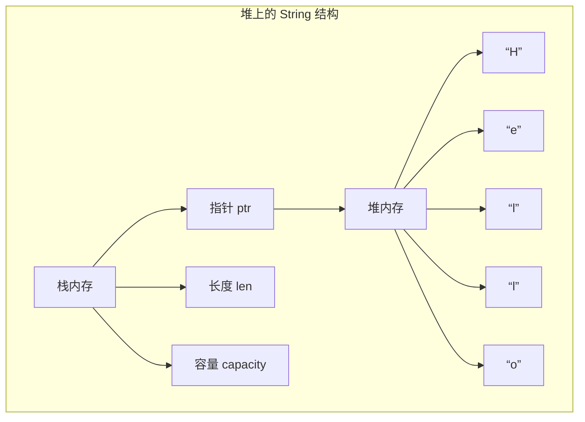
可以看到s1变量本身分配在栈上，然后有三个字段，指向堆内存值的一个指针，s1的长度，s1所指向堆数据的容量，想想看是不是和go的slice非常非常相似，
看这张图：
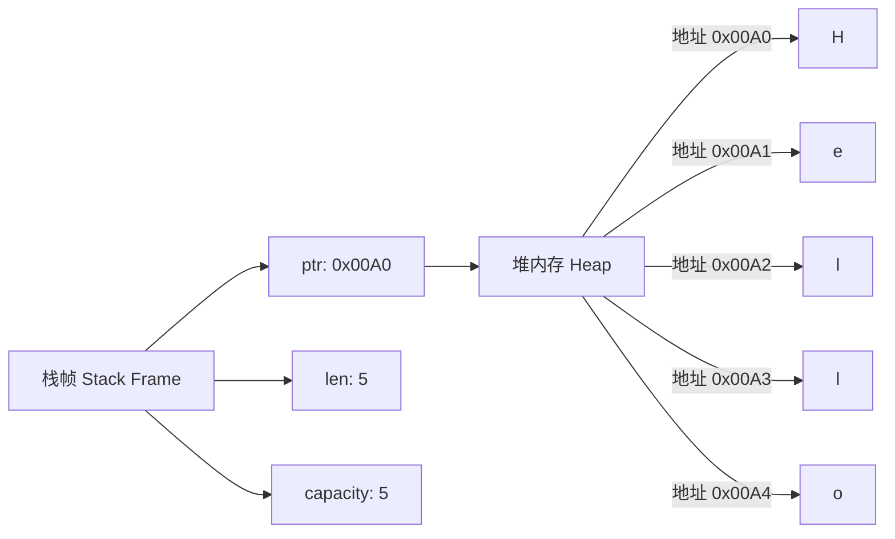
* ptr：指向堆内存中字符串数据的指针
* len：当前字符串实际长度（字节数）
* capacity：String 从操作系统分配的总容量

此时也就是s1拥有"hello"这个数据的所有权

#### 所有权移动
接着看代码：
```rust
let s1 = String::from("hello"); // 转移前
let s2 = s1; // 发生转移
// s1失效
// println!("{}", s1); // 错误！s1 已失效
```
此时数据"hello"的所有权从s1移动到了s2, 然后s1变量就被回收了，可以看下图，发生什么了：
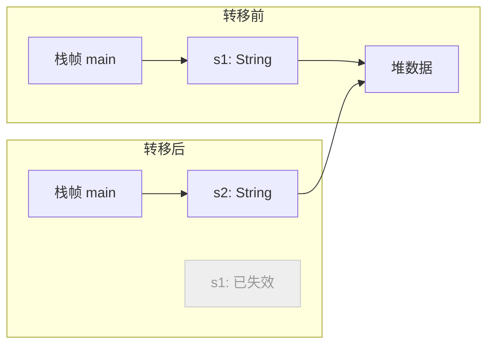
看看这是不是很符合三原则，那如果我们想使用s1应该怎么办呢？接下来看看clon

#### clone深拷贝
我觉得clone这个词用的非常好，很直观，就是clone一份，来看示例：
```rust
let s1 = String::from("hello");
let s2 = s1.clone(); // 创建新的堆分配

println!("{} {}", s1, s2); // 两个都有效
```
我们看他内部发生什么了：
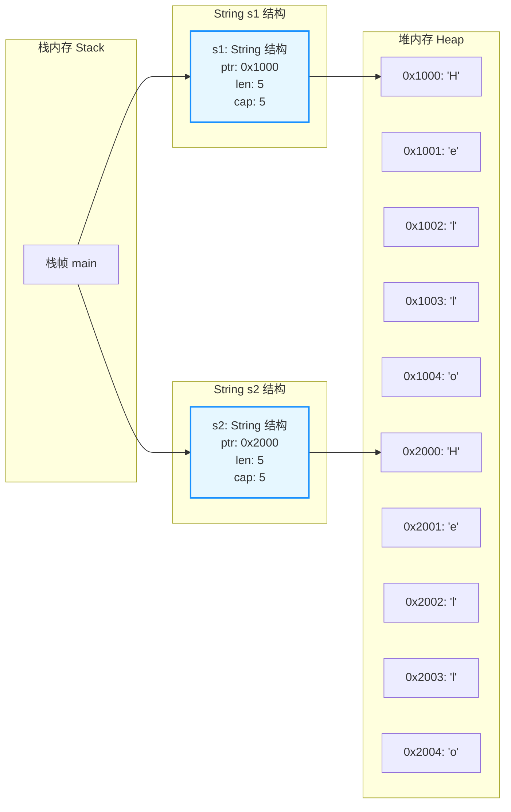
当我们使用clone后，会将"hello"值在内存中重新深拷贝一份，然后将其所有权交给s2,此时的s1和s2他们没有半毛钱关系了，再来看看这个示例：
```rust
let s1 = String::from("hello");
let s2 = s1.clone(); // 创建新的堆分配
s2.push_str(" World!"); // 给s2追加字符串
println!("{} {}", s1, s2); // 两个都有效
```
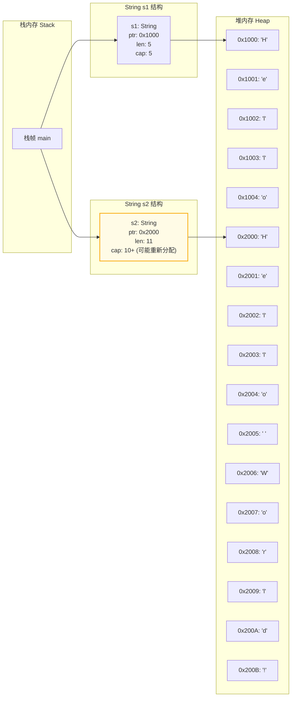
可以看到变量有用某一个值的所有权时，是可以随心所欲的，可以所以write和read，这看上去很符合所有权这个词


#### 所有权作用范围
还是将通过图文结合的方式详细解释 Rust 所有权的作用范围，使用 String 类型作为示例，先看代码：
```rust
fn main() {
    let s: String = String::from("global");
}
```
作用范围如下如所示：
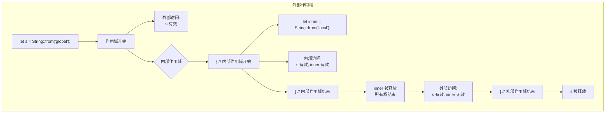
再来看这个示例：
```rust
fn main() {
    // ===== 外部作用域开始 =====
    let s = String::from("global"); // 所有者 s 进入作用域
    
    {
        // ===== 内部作用域开始 =====
        let inner = String::from("local"); // 所有者 inner 进入作用域
        
        println!("s: {}", s); // 有效
        println!("inner: {}", inner); // 有效
        
        // ===== 内部作用域结束 =====
    } // inner 在此被释放
    
    println!("s: {}", s); // 仍然有效
    // println!("inner: {}", inner); // 错误！inner 已离开作用域
    
    // ===== 外部作用域结束 =====
} // s 在此被释放
```
作用范围如下图所示：
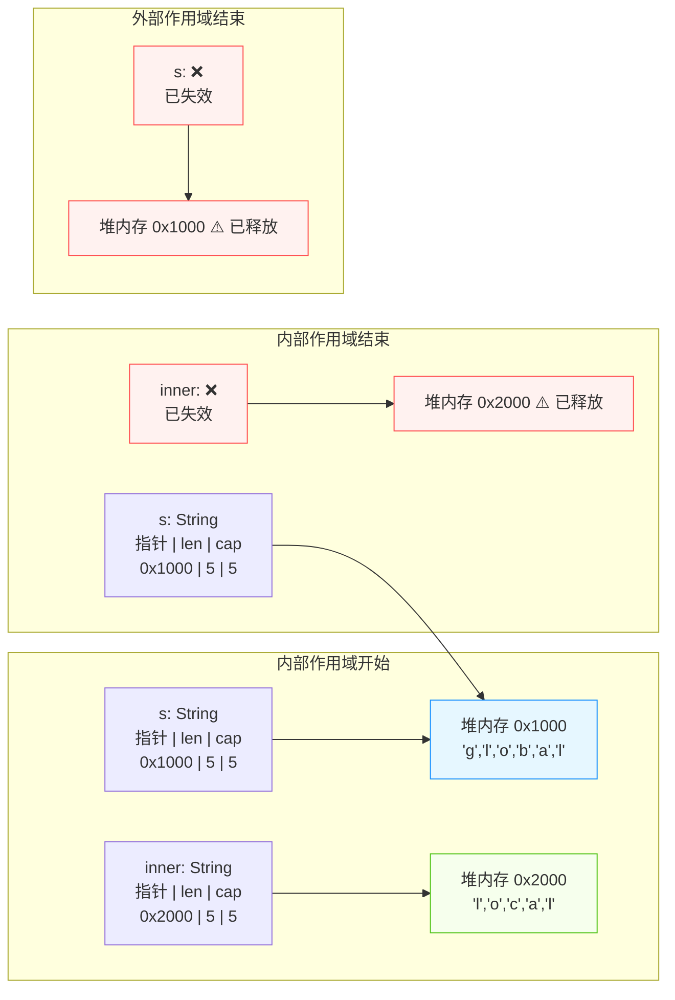
* 外层作用域：main 函数范围
* 内层作用域：由花括号 {} 创建的子作用域

##### 所有权时间线
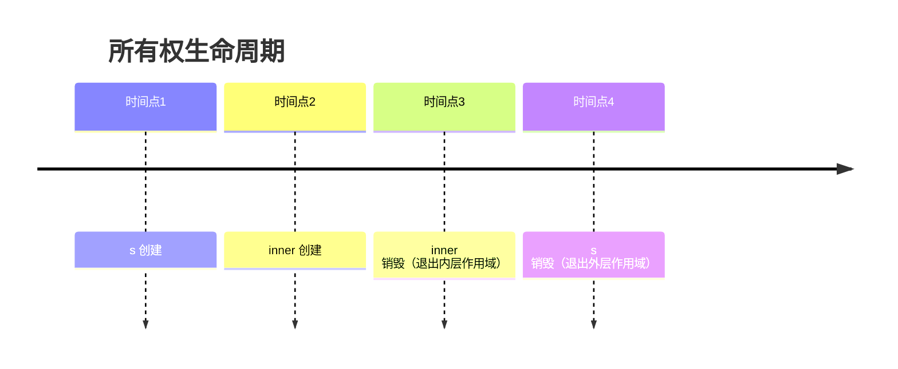

#### 函数入参所有权
上面我们了解所有权的原理，简单场景，下面我们来看看，将所有权变量传入函数中会发生什么，看示例：
```rust
fn main() {
    let s = String::from("hello");
    let len = get_len(s);

    println!("{} len: {}", s, len);
}

fn get_len(str: String) -> usize {
    str.len()
}
```
你可以尝试编译一下这个代码看看会发送什么？
答案：
```
> rustc main.rs 
error[E0382]: borrow of moved value: `s`
 --> demo1.rs:5:28
  |
2 |     let s = String::from("hello");
  |         - move occurs because `s` has type `String`, which does not implement the `Copy` trait
3 |     let len = get_len(s);
  |                       - value moved here
4 |
5 |     println!("{} len: {}", s, len);
  |                            ^ value borrowed here after move
  |
note: consider changing this parameter type in function `get_len` to borrow instead if owning the value isn't necessary
 --> demo1.rs:8:17
  |
8 | fn get_len(str: String) -> usize {
  |    -------      ^^^^^^ this parameter takes ownership of the value
  |    |
  |    in this function
  = note: this error originates in the macro `$crate::format_args_nl` which comes from the expansion of the macro `println` (in Nightly builds, run with -Z macro-backtrace for more info)
help: consider cloning the value if the performance cost is acceptable
  |
3 |     let len = get_len(s.clone());
  |                        ++++++++

error: aborting due to 1 previous error

For more information about this error, try `rustc --explain E0382`.

```
没错，所有权又发生转移了，来看看原理：
```rust
let len = get_len(s); //这里将s的所有权给到函数中的str了
```
此时str拥有了“hello”的所有权，然后他就可以在函数中所以修改这个值了，最后他返回了字符串的长度
str所有权变量的作用范围在函数内，离开函数str被drop
```rust
fn get_len(str: String) -> usize {
    str.len()
}
```
当我们再想使用s的所有权移动到函数的str中，如果再直接使用s看到就不行了
可以再看看这个图：
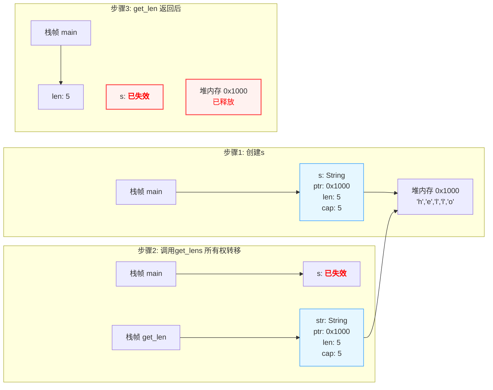


#### 函数返回值所有权
接下来看看返回值，我们可以将str返回，然后函数将其str的所有权转移给s1
```rust
fn main() {
    let s = String::from("hello");
    let (s1, len) = get_len(s); // 返回所有权
    
    println!("{} len: {}", s1, len); // 正确！
}

fn get_len(str: String) -> (String, usize) {
    let len = str.len();
    (str, len) // 返回所有权
}
```
如何所示：
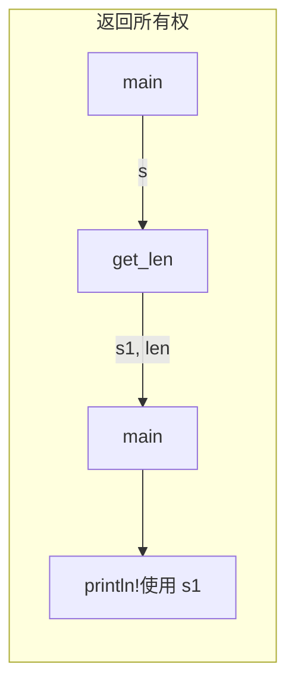


### 总结
这里我们快速的过来一遍rust的基础语法，从基础数据类型，复合数据类型，流程控制和函数，看上去其实也不难的是吧，不过别担心，这里的内容只是rust的冰山一角。


