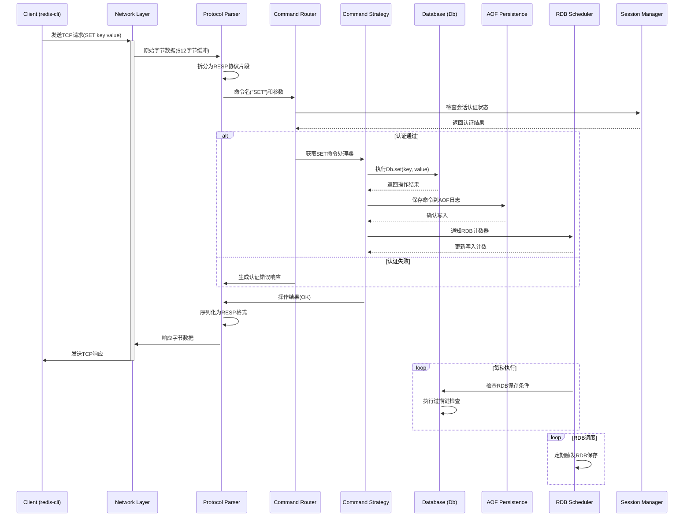

```mermaid
sequenceDiagram
    participant C as Client (redis-cli)
    participant N as Network Layer
    participant P as Protocol Parser
    participant R as Command Router
    participant S as Command Strategy
    participant D as Database (Db)
    participant A as AOF Persistence
    participant RD as RDB Scheduler
    participant SM as Session Manager

    %% 请求处理流程
    C->>+N: 发送TCP请求(SET key value)
    N->>+P: 原始字节数据(512字节缓冲)
    
    %% 协议解析阶段
    P->>P: 拆分为RESP协议片段
    P->>R: 命令名("SET")和参数
    
    %% 会话管理检查
    R->>+SM: 检查会话认证状态
    SM-->>R: 返回认证结果
    
    %% 命令路由与处理
    alt 认证通过
        R->>+S: 获取SET命令处理器
        S->>+D: 执行Db.set(key, value)
        D-->>S: 返回操作结果
        
        %% 持久化处理
        S->>+A: 保存命令到AOF日志
        A-->>S: 确认写入
        
        S->>+RD: 通知RDB计数器
        RD-->>S: 更新写入计数
    else 认证失败
        R->>P: 生成认证错误响应
    end
    
    %% 响应生成与返回
    S->>P: 操作结果(OK)
    P->>P: 序列化为RESP格式
    P->>N: 响应字节数据
    N->>C: 发送TCP响应
    
    deactivate N
    
    %% 后台任务
    loop 每秒执行
        RD->>D: 检查RDB保存条件
        D->>D: 执行过期键检查
    end
    
    loop RDB调度
        RD->>RD: 定期触发RDB保存
    end
```